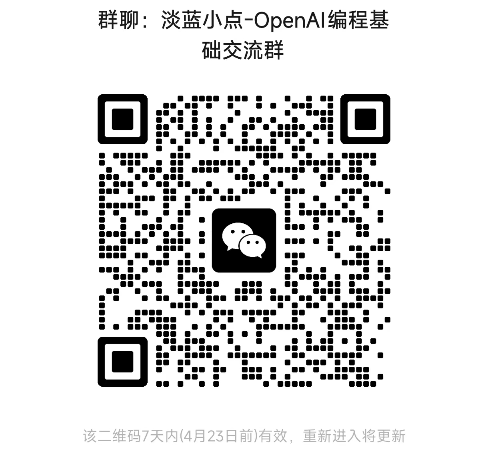

<h1> 淡蓝小点技术系列：OpenAI编程基础 </h1>

## 本Readme文件有待进一步完善

## 关于OpenAI编程基础
主要面向应用开发，而非算法研究。内容还在进一步补充设计中

## 课程形式及时间
还不确定采用哪种形式：直播或者录屏。
时间也待定。
请添加淡蓝小点微信（bluedotdot_cn）或入群，准确消息会在朋友圈和微信群内发布。

## 是否收费
这一系列会收取一定的费用。具体费用视最终内容量及难易程度而定。大约在29~49元/60分钟之间。

## 谁是淡蓝小点
淡蓝小点是PRML Page-by-page项目的发起人，这是一个旨在帮助机器学习从业人员读懂PRML每一页的项目，它包括约80小时的视频和一本1000页的note，可通过下面链接找到相关视频。若想要note请加微信索取。

PRML Page-by-page：https://space.bilibili.com/353555504?spm_id_from=333.1007.0.0

微信号及二维码：bluedotdot_cn

